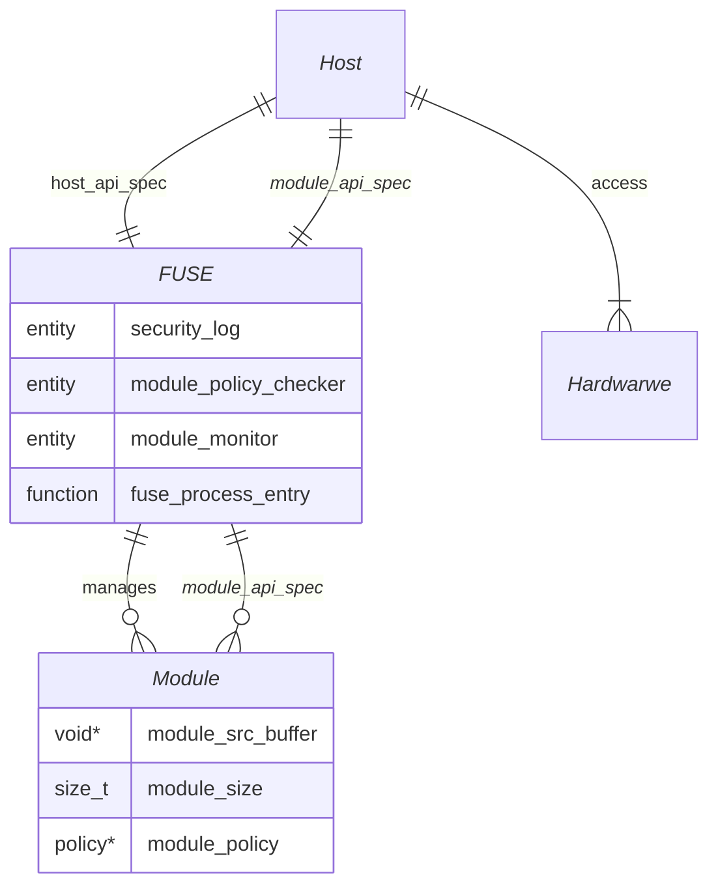

# FUSE Architecture & Security Policy

## System Topology
- The system follows a "Strict Air-Gap" model where a *Module* is physically and logically isolated from other *Modules* and the *Host*. *Module* can only communicate with outside through API calls that *FUSE* provides, documented in @module_api_spec.md.
- *Host* manages *FUSE* and *Module* through APIs provided by *FUSE*, documented in `@host_api_spec.md`.
- *Module* calls to *FUSE* will be handled APIs defined in `@module_api_spec.md`. *FUSE* will check all module calls against *Policy* 
- *FUSE* monitor all loaded *Module*, log critical issues, and report to *Host* for critical failures.
- mermaid diagram for the topology:

## Security Constraints
- Memory Isolation: *Module* is restricted to its own Linear Memory. *FUSE* must validate all incoming memory access against *Policy*
- No Dynamic Allocation: *module_api_spec* shall not trigger malloc/free. All data transfers must use pre-allocated buffers.
- Capacity Bitmask: every *Module* is assigned a bitmask in *Policy* at loading time. *FUSE* checks this mask before executing module_api functions for hardware accesses.
- Security Logging: any out-of bound access of an unauthorized module_api calls, *FUSE* shall immediately trap the module instance and log a security violation to the security log.
