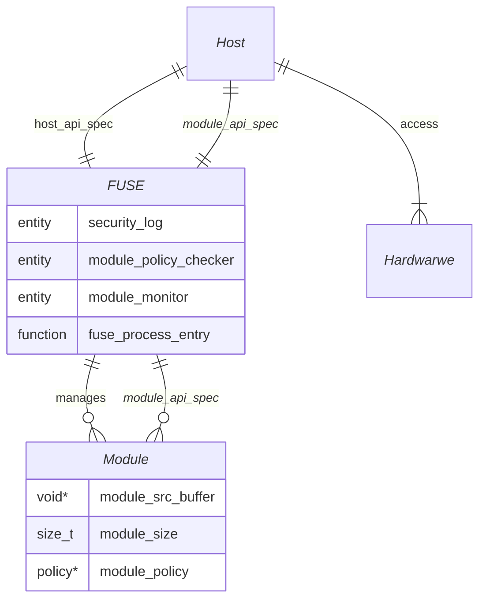

# FUSE Architecture & Security Policy

## System Topology
- The system follows a "Strict Air-Gap" model where a *Module* is physically and logically isolated from other *Modules* and the *Host*. *Module* can only communicate with outside through API calls that *FUSE* provides, documented in @module_api_spec.md.
- *Host* manages *FUSE* and *Module* through APIs provided by *FUSE*, documented in `@host_api_spec.md`.
- *Module* calls to *FUSE* will be handled APIs defined in `@module_api_spec.md`. *FUSE* will check all module calls against *Policy* 
- *FUSE* monitor all loaded *Module*, log critical issues, and report to *Host* for critical failures.
- mermaid diagram for the topology:

## HAL Group Architecture
Hardware APIs are organized into compile-time-conditional groups. Each group lives under `core/<group>/`:

| Group | Source | Flag | Capability |
|-------|--------|------|------------|
| Temperature sensor | `core/temp/` | `FUSE_HAL_ENABLE_TEMP_SENSOR` | `FUSE_CAP_TEMP_SENSOR` |
| Timer | `core/timer/` | `FUSE_HAL_ENABLE_TIMER` | `FUSE_CAP_TIMER` |
| Camera | `core/camera/` | `FUSE_HAL_ENABLE_CAMERA` | `FUSE_CAP_CAMERA` |
| Log | `core/log/` | *(always compiled)* | `FUSE_CAP_LOG` |

**Compile-time selection**: `FUSE_HAL_ENABLE_*` flags are set from `app_config.json` via
`tools/gen_app_config.py` → `fuse_hal_flags.cmake` → `target_compile_definitions(fuse PUBLIC ...)`.
The entire body of each group `.c` file is wrapped in its `#ifdef` guard, producing zero dead code
when a group is disabled. Without `-DFUSE_APP_CONFIG=...`, all groups are enabled (dev/test default).

**Validation rule**: every module's `capabilities` (excluding `LOG`) must be a subset of the
platform's `hal_groups` in `app_config.json`. `gen_app_config.py` enforces this at configure time.

**WAMR registration**: `fuse_init()` calls `fuse_hal_<group>_register_natives()` per enabled group
after `wasm_runtime_full_init()`. The log group is always registered unconditionally.

## Security Constraints
- Memory Isolation: *Module* is restricted to its own Linear Memory. *FUSE* must validate all incoming memory access against *Policy*
- No Dynamic Allocation: *module_api_spec* shall not trigger malloc/free. All data transfers must use pre-allocated buffers.
- Capacity Bitmask: every *Module* is assigned a bitmask in *Policy* at loading time. *FUSE* checks this mask before executing module_api functions for hardware accesses.
- Security Logging: any out-of bound access of an unauthorized module_api calls, *FUSE* shall immediately trap the module instance and log a security violation to the security log.

## CPU Quota Design
WAMR's `wasm_runtime_set_instruction_count_limit()` only works in **interpreter mode**, not AOT. FUSE uses **time-based quota** instead:

- `fuse_policy_t.cpu_quota_us` — max microseconds per `module_step()` call (0 = no limit)
- `fuse_hal_t.quota_arm(module_id, quota_us)` — host arms a one-shot hardware timer before each step
- `fuse_hal_t.quota_cancel(module_id)` — host cancels the timer on normal step return
- `fuse_quota_expired(module_id)` — host calls from timer ISR; ISR-safe (only calls `wasm_runtime_terminate()` + atomic fence)
- On quota expiry: module transitions to `FUSE_MODULE_STATE_QUOTA_EXCEEDED`, FATAL log entry written, `fuse_module_run_step()` returns `FUSE_ERR_QUOTA_EXCEEDED`
- `wasm_runtime_terminate()` sets an atomic flag in the exec_env; WAMR detects it and raises `"terminated by user"` exception, which unwinds the AOT call stack

## Module Execution Model
- *Module* must export `module_step()` — FUSE drives execution by calling it once per scheduling quantum via `fuse_module_run_step()`
- *Module* must NOT contain infinite loops inside `module_step()` — all work must complete within one call
- Optional exports: `module_init()` called once on first `fuse_module_start()`, `module_deinit()` called on `fuse_module_unload()` (skipped if module is TRAPPED or QUOTA_EXCEEDED)
- Module state machine: `LOADED → RUNNING ↔ PAUSED`, `RUNNING → TRAPPED` (policy/exception), `RUNNING → QUOTA_EXCEEDED` (timer)
